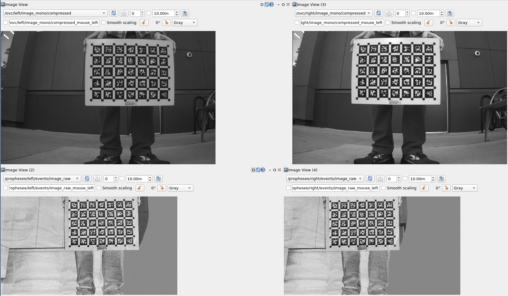

# sync_event_frames

ROS/ROS2 package to reconstruct synchronized event camera image frames
from events. This package will allow you to convert a rosbag with
event and frame based camera topics into a bag with synchronized,
reconstructed frames that can be used for intrinsic and extrinsic
calibration.

The event data must be stored in 
[event_camera_msgs](https://github.com/ros-event-camera/event_camera_msgs) format. The
core logic of event reconstruction can be found in the
[simple image recon library package](https://github.com/berndpfrommer/simple_image_recon_lib).

The following synchronized frames were generated from two
hardware-synchronized frame cameras and two event cameras (without a
sync cable between them):


IMPORTANT: if multiple frame based cameras are used, they *must* be hardware or otherwise synchronized such that their ROS header time stamps all match.

## Supported platforms

Currently tested on Ubuntu 20.04 under ROS Noetic and ROS2
Galactic. Continuous integration testing also for Ubuntu 22.04 under
ROS2 Humble.


### How to build

Set the following shell variables:
```bash
repo=sync_event_frames
url=https://github.com/ros-event-camera/${repo}.git
```
and follow the [instructions here](https://github.com/ros-misc-utilities/.github/blob/master/docs/build_ros_repository.md)


## How to use

The ``bag_to_frames`` command takes a bag with event and synchronized frame camera messages as input and produces a bag with the original camera frames plus reconstructed event camera frames. Here is the comand usage (launch with ``rosrun`` or ``ros2 run``:
```
bag_to_frames -i input_bag -o output_bag -t event_camera_input_topic [-T event_frame_output_topic] [-c frame_camera_input_topic] [-f frame_rate]
```
If you have multiple cameras, specify the respective flag multiple times, once for each camera.

You can use this in two modes:
1) free running. Use this mode if you don't have a frame based camera, but e.g. two event cameras that you want to calibrate intrinsically and extrinsically. This mode is activated by specifying the frame rate (``-f``). The output bag will contain reconstructed event frame images but no frame camera images as those are ignored.
2) frame camera driven. Here the event camera frames will be reconstructed such that they are synchronized with the frame camera time stamps. The frame camera images must be synchronized, i.e. the header stamp of the image messages *must* have identical time stamps across all frame cameras.

If the output topics (``-T option``) are not specified they will become the events topic with ``/image_raw`` appended.

Example how to reconstruct frames for the [m3ed data set](https://github.com/daniilidis-group/m3ed):
```
rosrun sync_event_frames bag_to_frames -i input.bag -o synced.bag -t /prophesee/left/events -t /prophesee/right/events -c /ovc/left/image_mono/compressed -c /ovc/right/image_mono/compressed
```

The same in free running mode:
```
rosrun sync_event_frames bag_to_frames -i input.bag -o synced.bag -f 25.0 -t /prophesee/left/events -t /prophesee/right/events
```

## License

This software is issued under the Apache License Version 2.0.
